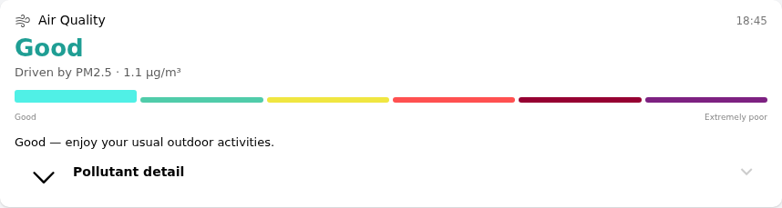

# air_quality_card — European Air Quality Index Report

A readable air-quality widget built on the [European Air Quality Index (EAQI)](https://airindex.eea.europa.eu/AQI/index.html) — the same six-band scale (Good → Extremely poor) used across the EU. Rather than surfacing raw pollutant concentrations, it shows a plain-language verdict, names the pollutant driving that verdict, and gives one-sentence health advice, with per-pollutant detail available on demand.

The card is a native Main UI widget (`f7-card`) — no companion HTML file, no external API calls at render time. All the EAQI math (banding each pollutant, picking the worst, deriving category/advice text) happens server-side in an openHAB rule; the widget only displays pre-computed items.

---

## Screenshot

## What it shows

- **Verdict**: the EAQI category (Good/Fair/Moderate/Poor/Very poor/Extremely poor) in its official EEA color
- **Driven by**: which pollutant set the overall index, and its value — the overall index is always the *worst* sub-index across all five pollutants, so this is never a guess
- **Six-segment band strip**: the current band visually marked
- **One-sentence advice**, condensed from the EEA's own official health-advice copy
- **Expandable "Pollutant detail"**: PM2.5, PM10, NO2, O3, SO2 — each with its own value and color-coded band, so a bare µg/m³ number never appears without context

## Requirements

- OpenHAB 5.x (tested on 5.2.x)
- [OpenWeatherMap Air Pollution](https://www.openhab.org/addons/bindings/openweathermap/) thing (`openweathermap:air-pollution`) — needs an `openweathermap:weather-api` bridge configured with your API key and location
- A rule that computes the four "computed" items below from the five raw pollutant channels (see [Setup](#setup))

---

## Setup

### 1. Add the Air Pollution thing

In your OpenWeatherMap account bridge, add an **Air Pollution** thing. No extra configuration needed beyond location — `forecastHours: 0` is fine since this widget only uses `current#*` channels.

### 2. Create and link items

Ten items in total — six linked directly to binding channels, four computed by a rule:

| Item | Type | Channel / Source |
|------|------|-------------------|
| `*_PM25` | `Number:Density` | `current#particulateMatter2dot5` |
| `*_PM10` | `Number:Density` | `current#particulateMatter10` |
| `*_NO2` | `Number:Density` | `current#nitrogenDioxide` |
| `*_O3` | `Number:Density` | `current#ozone` |
| `*_SO2` | `Number:Density` | `current#sulphurDioxide` |
| `*_Timestamp` | `DateTime` | `current#time-stamp` |
| `*_EAQI` | `Number` | computed (1–6) |
| `*_Category` | `String` | computed ("Good" … "Extremely poor") |
| `*_Dominant` | `String` | computed ("PM2.5", "PM10", "NO2", "O3", or "SO2") |
| `*_Advice` | `String` | computed (one sentence) |

Give each `Number:Density` item `unit` metadata of `µg/m³` — the binding's native unit is kg/m³, and once the unit metadata is set, `numericState` reads directly in µg/m³ with no manual conversion needed.

### 3. Add the EAQI computation rule

A JS rule, triggered on state change of the five pollutant items (plus a periodic backstop, e.g. every 15 minutes, for restart survival), that:

1. Bands each pollutant against the table below
2. Takes the **maximum** band across all five (the official EAQI methodology — the index is always driven by the worst pollutant)
3. Posts the four computed items

EAQI band thresholds (µg/m³), 2024 revision aligned to WHO 2021 guidelines:

| | Good | Fair | Moderate | Poor | Very poor | Extremely poor |
|---|---|---|---|---|---|---|
| PM2.5 | 0–5 | 6–15 | 16–50 | 51–90 | 91–140 | >140 |
| PM10 | 0–15 | 16–45 | 46–120 | 121–195 | 196–270 | >270 |
| NO2 | 0–10 | 11–25 | 26–60 | 61–100 | 101–150 | >150 |
| O3 | 0–60 | 61–100 | 101–120 | 121–160 | 161–180 | >180 |
| SO2 | 0–20 | 21–40 | 41–125 | 126–190 | 191–275 | >275 |

Official EEA band colors (used throughout this widget): Good `#50f0e6`, Fair `#50ccaa`, Moderate `#f0e641`, Poor `#ff5050`, Very poor `#960032`, Extremely poor `#7D2181`.

### 4. Install the widget

1. Open **Developer Tools → Widgets** in the Main UI sidebar
2. Click **+** → **Code** tab
3. Paste the contents of [`widget.yaml`](widget.yaml)
4. Click **Save**

### 5. Add to a page

Drag in a **Custom Widget** block, set the widget type to `air_quality_card`, and fill in the ten item props.

---

## Props reference

| Prop | Type | Required | Description |
|------|------|----------|-------------|
| `eaqiItem` | item | yes | Computed EAQI band, 1–6 |
| `categoryItem` | item | yes | Computed category text |
| `dominantItem` | item | yes | Computed dominant pollutant name |
| `adviceItem` | item | yes | Computed advice sentence |
| `timestampItem` | item | no | Last-measured time, shown top-right |
| `pm25Item` / `pm10Item` / `no2Item` / `o3Item` / `so2Item` | item | yes | Raw pollutant readings, µg/m³ |
| `title` | text | no | Card title, defaults to "Air Quality" |
| `icon` | text | no | Header icon, defaults to `f7:wind` |

## Gotchas

- **`badgeColor` on `oh-list-item`/`oh-toggle-card` only accepts Framework7's named color tokens** (`red`, `green`, `teal`, `deeppurple`, …), not arbitrary hex — this widget avoids that prop entirely for the pollutant-detail badges, using a styled `Label` in an `[after]` slot instead, which does accept a raw hex `style.background` and renders properly right-aligned.
- **`Number:Density` items report kg/m³ by default** — OpenWeatherMap's native SI unit — set `unit` metadata to `µg/m³` on each pollutant item or every value renders in scientific notation.
- **The "Forecasted Particulate Matter - PM10" channel label is an upstream naming slip** on the binding's *current*-value channel (`current#particulateMatter10`) — use the channel ID, not the label.

---

## Changelog

### Version 1.0.3

- Pollutant labels (name + description) are now left-aligned within their column (v1.0.2 had them right-aligned, matching the value side — reverted per feedback to normal reading order while keeping the column itself positioned before the value)
- Replaced the "Pollutant detail" toggle: was an `oh-list-item` accordion header (bold title, left chevron); now uses `f7-accordion-item`/`f7-accordion-toggle`/`f7-accordion-content` directly, matching the "GPS Track" toggle style in `lawn_mower` (small colored icon, 13px gray label, 12px gray chevron on the right)

### Version 1.0.2

- Fixed the accordion detail rows: v1.0.1 used `f7-list-item`'s `title`/`subtitle` slots to right-align the label, but that component only builds its flex "title-row" layout when the `title` *prop* is truthy — with slots only, the row collapsed and the `subtitle` slot was silently dropped entirely (pollutant descriptions vanished). Rebuilt each row as a plain `f7-row` with two `f7-col` children (name+description column, `flex:1` `text-align:right`; value+badge column, `flex:0 0 auto`), the same pattern already used in `humidity_room_card`'s legend rows — no more reliance on `f7-list-item`'s title/subtitle/after semantics. Also restored the divider lines between rows (manual `border-bottom`, since the `f7-list`/`f7-list-item` wrapper was dropped).

### Version 1.0.1

- Right-aligned the pollutant name/description in the accordion (was left-aligned, sitting far from the value); value + badge remain right-aligned in their own column

### Version 1.0.0

- Initial release: EAQI verdict, six-band strip, driven-by pollutant, advice text, expandable per-pollutant detail with right-aligned color-coded badges
