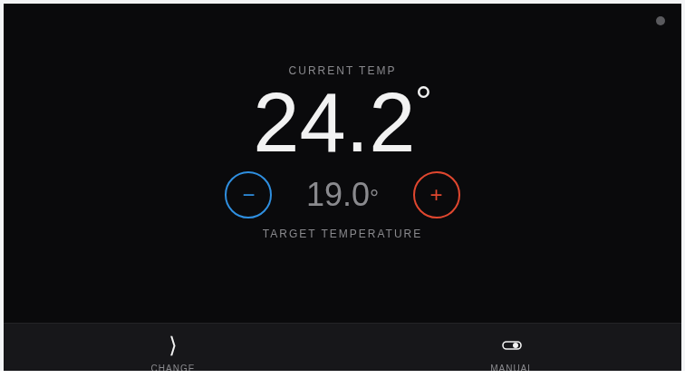
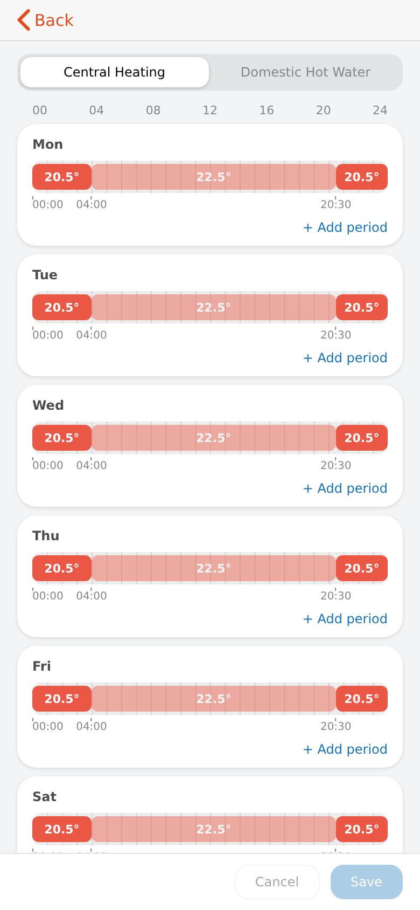
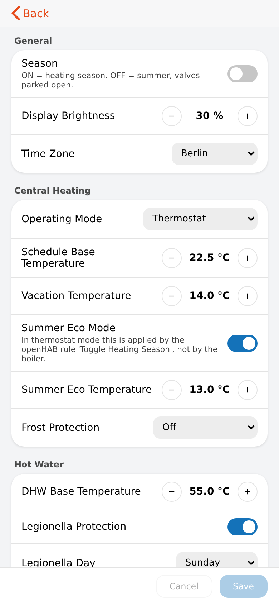
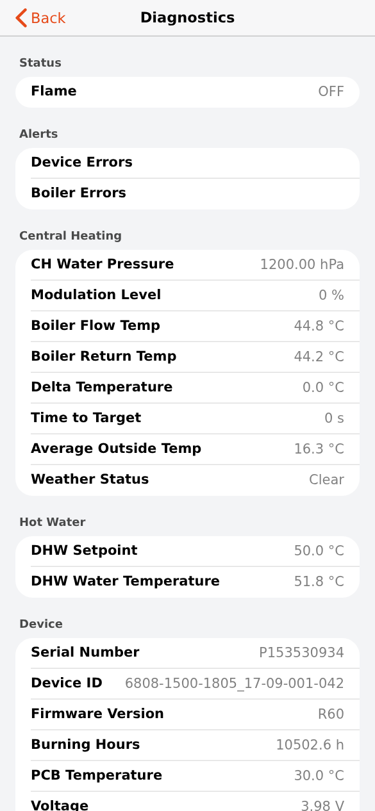

# ATAG ONE widgets

Six widgets for one device: an ATAG ONE thermostat and boiler, integrated through the openHAB `atagone` binding.
Each widget is independent — place any of them on its own page — and keeps its own README, version and changelog.

| Widget | Version | Shows |
|---|---|---|
| [`atag_one_card`](atag_one_card/) | 1.1.5 | Thermostat control face: current/target temperature, steppers, mode selector, vacation / extend / fireplace duration picker |
| [`atag_schedule_card`](atag_schedule_card/) | 1.1.0 | Weekly central-heating / hot-water schedule editor (24 h timeline per day) |
| [`atag_regulation_card`](atag_regulation_card/) | 2.2.0 | Regulation settings: central heating, weather-dependent control, hot water, display |
| [`atag_diagnostics_card`](atag_diagnostics_card/) | 2.0.0 | Read-only boiler diagnostics (Information → Diagnosis) |
| [`atag_heating_chart`](atag_heating_chart/) | 1.1.0 | Central heating chart: target vs. room vs. outside temperature, summer eco threshold, burner overlay |
| [`atag_hotwater_chart`](atag_hotwater_chart/) | 1.1.0 | Domestic hot water chart: target vs. current temperature, burner overlay |

| | | |
|---|---|---|
|  |  |  |
|  | | |

## Common requirements

- openHAB 5.x with the `atagone` binding and one `thermostat` Thing; the widgets read and command items linked to its channels
  (the per-widget READMEs list the channel → prop mapping). Widgets never ship items.
- Fireplace, vacation and extend modes exist only as Thing Actions (`activateFireplace`, `activateVacation`,
  `activateExtend`, `cancelMode`) — the control card needs them, a plain item cannot start them.
- The charts need `rrd4j` persistence for their items; the schedule editor needs the binding's `heating#schedule` /
  `hotwater#schedule` channels.
- Three widgets ship an HTML companion for `oh-webframe` (`control.html`, `schedule.html`, `regulation.html`); deploy it to
  `/etc/openhab/html/atag/` as described in the widget's README.

Install each widget separately (see the [top-level README](../../README.md)).
