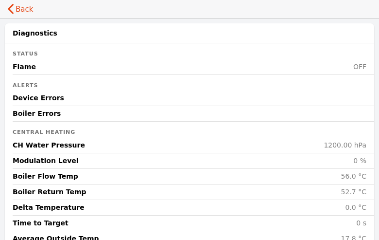

# atag_diagnostics_card — ATAG ONE Boiler Diagnostics

Read-only boiler diagnostics, matching the ATAG ONE app's Information → Diagnosis screen, as a
single accordion card.

---

## Screenshot

## What it shows

One accordion section listing: water pressure, modulation level (+ minimum), burner target,
flame, burning hours, boiler flow/return temperature, delta temperature, time to target, max
boiler temperature, average outside temperature, weather status, regulation state, PCB
temperature, voltage, WiFi signal, controller resets, memory allocation, report time, device
errors, boiler errors.

All rows are `oh-label-item` — display only, nothing here writes to the device.

## Quick start

### 1. Install the widget

1. Open **Developer Tools → Widgets** in the Main UI sidebar
2. Click **+** → **Code** tab
3. Paste the contents of [`widget.yaml`](widget.yaml)
4. Click **Save**

### 2. Add to a page

Add a Custom Widget block, set type to `atag_diagnostics_card`, and set the item props for the
channels you want to expose.

---

## Props reference

All props are optional item pickers, one per diagnostic channel — see `widget.yaml` for the full
list; each prop's description names the exact `atagone` channel it targets.

## Requirements

- OpenHAB 5.x (tested on 5.2.x)
- The `atagone` binding

---

## Changelog

### Version 1.0.0

- Initial release
