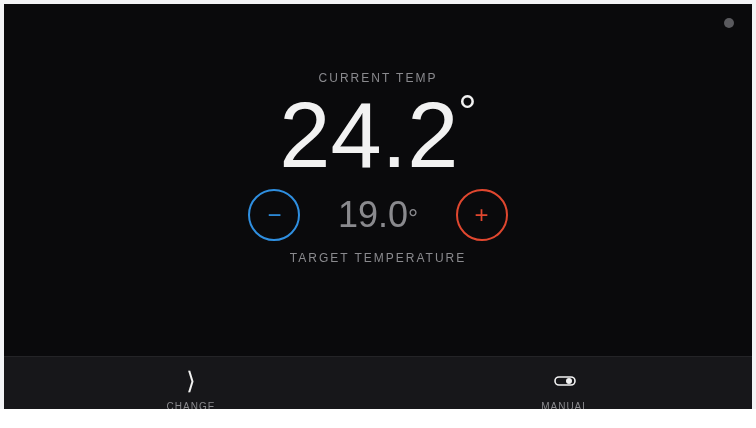

# atag_one_card — ATAG ONE Thermostat Control Face

A pixel-styled recreation of the official ATAG ONE app/portal control screen — the current and
target room temperature, blue/red steppers, mode selector, and an in-frame duration picker for
Vacation/Extend/Fireplace. Always dark, matching the real device.

---

## Screenshot

## What it shows

- Large current-room-temperature readout, with a flame indicator dot top-right — solid red while
  central heating is actively firing, blinking while domestic hot water is (the boiler can only
  heat one circuit at a time, so the dot is never both)
- Target temperature with blue (lower) / red (raise) steppers, debounced (1.5 s of no further taps)
  to one write per pause rather than one write per tap — the target number turns amber while a
  change is pending confirmation
- Bottom bar is mode-conditional, matching how the official app itself changes this bar per mode:
  in **Automatic** it shows 4 cells (Change / Next Time / Mode / Next Temp); in any other mode
  (Manual, Vacation, Extend, Fireplace) "next scheduled change" doesn't apply, so it collapses to
  2 cells (Change / Mode), each taking half the bar
- Tapping the mode cell opens a 5-mode picker (Automatic / Vacation / Extend / Fireplace / Manual)
- Vacation / Extend / Fireplace each open a duration picker (days / 15-min steps / hours) before
  activating, calling the binding's Thing Actions directly
- Cancel button for any active timed mode — surfaces the binding's "requires physical confirmation"
  result rather than reporting a false success (fireplace mode cannot be cancelled remotely; a
  button press on the thermostat is required)

## Quick start

### 1. Install the widget

1. Open **Developer Tools → Widgets** in the Main UI sidebar
2. Click **+** → **Code** tab
3. Paste the contents of [`widget.yaml`](widget.yaml)
4. Click **Save**

### 2. Deploy the companion HTML

Upload [`control.html`](control.html) to `$OPENHAB_CONF/html/atag/control.html` (served at
`/static/atag/control.html`).

### 3. Add to a page

Add a Custom Widget block, set type to `atag_one_card`, and set the **ATAG Thing** prop plus the
item props for the channels you want live.

---

## Props reference

| Prop | Required | Description |
|------|----------|-------------|
| `thingUID` | Yes | The `atagone:thermostat:...` Thing UID — used to resolve and call its Thing Actions |
| `currentTempItem` | Yes | Room (current) temperature — `heating#room-temperature` |
| `targetTempItem` | Yes | Target temperature setpoint — `heating#target-temperature` (writable) |
| `modeItem` | Yes | Preset mode string — `control#preset-mode` |
| `flameItem` | No | Flame indicator — `heating#flame`. Used as a fallback solid-red dot when `chActiveItem`/`dhwActiveItem` aren't set |
| `chActiveItem` | No | Central heating active — `heating#central-heating-active`. Drives the flame dot's solid-red state |
| `dhwActiveItem` | No | Domestic hot water active — `hotwater#status`. Drives the flame dot's blinking-red state (CH and DHW can't be active at once — it's a single burner) |
| `nextTimeItem` | No | Next scheduled time — `control#next-schedule-time` |
| `nextTempItem` | No | Next scheduled temperature — `control#next-schedule-temperature` |
| `vacationDurationItem` | No | Seeds the vacation duration picker's default |
| `vacationTempItem` | No | Reserved for future use |
| `vacationRemainingItem` | No | Reserved for future use |
| `extendDurationItem` | No | Seeds the extend duration picker's default |
| `extendRemainingItem` | No | Reserved for future use |
| `fireplaceDurationItem` | No | Seeds the fireplace duration picker's default |
| `fireplaceRemainingItem` | No | Reserved for future use |

## Requirements

- OpenHAB 5.x (tested on 5.2.x)
- The `atagone` binding with a `thermostat` Thing exposing the channels above and the
  `activateVacation` / `activateExtend` / `activateFireplace` / `cancelMode` Thing Actions

## Gotchas

- The widget-config `=` expression sandbox is missing `encodeURIComponent` — the `src` builder
  concatenates prop values raw rather than URL-encoding them. Safe here since item/Thing names
  contain no query-string-reserved characters; don't copy this pattern for values that might.
- Bump `?v=N` in the `src` expression whenever `control.html` changes — browsers cache the file.

---

## Changelog

### Version 1.1.1

- Rounded corners (4px, matching the Framework7 default card radius) applied to the widget's
  `oh-webframe` via a `style` override — the iframe was previously a square-cornered rectangle,
  out of place next to the page's other (native, rounded) cards.
- `control.html`'s `#face` (main dial content) now uses 16px padding on all sides, matching the
  Framework7 default card content padding (`--f7-card-content-padding-horizontal/vertical`), so
  the widget's content inset matches other cards on the page. The bottom action bar stays
  edge-to-edge on purpose — its own `--bar-bg` background is the toolbar, and the outer rounded
  corners (from the iframe-level style above) still round its bottom two corners.

### Version 1.1.0

- Added `dhwActiveItem` prop — the flame dot now distinguishes central heating (solid red) from
  domestic hot water (blinking red), matching the physical thermostat's LED behavior, instead of a
  single solid/off state
- Setpoint debounce widened from 800 ms to 1.5 s, with the target number turning amber while a
  change is pending — a run of rapid taps now sends one write instead of one per tap
- Larger control face and icons (mobile legibility pass)

### Version 1.0.0

- Initial release
