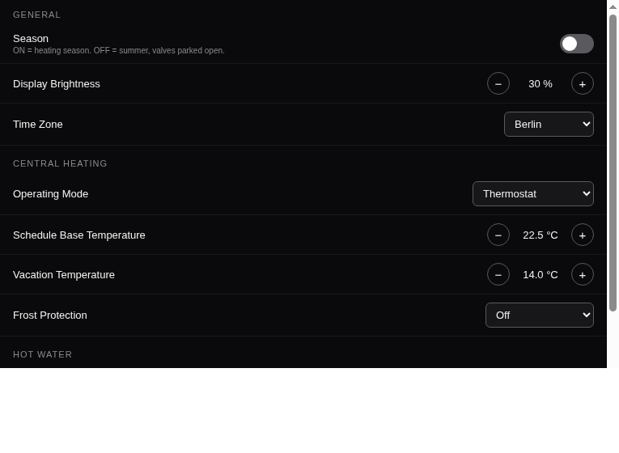

# atag_regulation_card — ATAG ONE Regulation Settings

The ATAG ONE's "Regulation" settings screen — central heating, weather-dependent control, hot
water, and display — as a four-section accordion card.

---

## Screenshot

## What it shows

Four always-visible sections (flat, not collapsible — this card only ever appears inside a popup,
so a second layer of expand/collapse on top of that would just be redundant clicking):

- **Central Heating** — operating mode (tap to switch thermostat ↔ weather-dependent), schedule
  base temperature, vacation temperature
- **Weather Dependent** — heating type, insulation, building size, room influence, climate zone,
  max preheat, frost protection (mode + room/outside thresholds). Visually dimmed and
  non-interactive while Central Heating's operating mode is `thermostat` (these settings are
  ignored by the device in that mode). **Summer Eco Mode/Temperature are shown regardless of
  operating mode** — in `thermostat` mode the device itself ignores them, but the openHAB rule
  `Toggle Heating Season` reads them to drive the seasonal heating on/off switch instead
- **Hot Water** — DHW base temperature, legionella protection (on/off, day, and time — a plain
  `HH:mm` text field)
- **Display** — brightness, time zone

Every enum setting (Operating Mode, Heating Type, Insulation, Building Size, Room Influence, Max
Preheat, Frost Protection, Legionella Day, Time Zone) is tappable — `action: "options"` opens the
native selection sheet. A plain `oh-list-item` bound only via `item:` shows nothing and does
nothing (see Gotchas).

## Quick start

### 1. Install the widget

1. Open **Developer Tools → Widgets** in the Main UI sidebar
2. Click **+** → **Code** tab
3. Paste the contents of [`widget.yaml`](widget.yaml)
4. Click **Save**

### 2. Add to a page

Add a Custom Widget block, set type to `atag_regulation_card`, and set the item props for the
channels you want to expose.

---

## Props reference

All props are optional item pickers except `controlModeItem`, grouped in the editor as Central
Heating / Weather Dependent / Hot Water / Display. See `widget.yaml` for the full list — each
prop's description names the exact `atagone` channel it targets.

**DHW note**: use `dhwScheduleBaseTempItem` (→ `hotwater#schedule-base-temperature`) for the hot
water setpoint, not the binding's `hotwater#target-temperature` channel — that channel is
derived/read-only on the device side and a known broken write path (see the `atagone` binding's
own test notes).

**Unit note**: `displayBrightnessItem` steps 0.1–1.0 (a fraction, matching its actual reported
scale), not 10–100 as its channel's own `%`-pattern implies — `oh-stepper-item` reads and writes
the item's raw base-unit value directly and does not apply `unit` metadata for display or
conversion.

**`legionellaProtectionTimeItem` note**: a plain `String` item in `HH:mm` format (e.g. `07:00`).
The widget validates the format client-side and rejects an edit that doesn't match before it's
sent.

## Requirements

- OpenHAB 5.x (tested on 5.2.x)
- The `atagone` binding

## Gotchas

- **`oh-list-item` bound via `item:` alone renders nothing and does nothing** — no value shown, no
  tap affordance, confirmed via live DOM inspection (a plain `
`, not even an `<a>`). Add
  `action: "options"` to get the standard tap-to-open-a-selection-sheet behavior for a String item
  with enum options; the row then renders as an `<a class="item-link">` with a `›` chevron and
  opens a native picker on tap. This isn't documented in `describe_widget('oh-list-item')`'s prop
  list (which only covers title/subtitle/icon/badge/listButton) — `action` is accepted anyway as
  an "extra" config key per the component's own action-grammar support.
- **A flex row needs an explicit `width: 100%` inside a card-content column, or it shrink-wraps**
  — without it, `flex: "1"` on a child has no free space to grow into, so trailing content sits
  stranded mid-row instead of flush right. See `humidity_room_card`'s header row for the same fix.

---

## Changelog

### Version 2.2.0

- Save now confirms every changed field against the device instead of trusting the write's own
  HTTP response — the ATAG's embedded HTTP server is known to drop requests silently (see the
  `atagone` binding's own test notes), so a value could look saved and then quietly revert once
  the next poll read back the device's unchanged old value. Save now waits out one
  `refreshInterval` poll (~70s) after sending, re-reads, and retries once if a field didn't stick;
  the status line reports "Confirmed" / "…retrying…" / which fields the ATAG rejected, instead of
  an immediate "Saved" that could be wrong

### Version 2.1.0

- Summer Eco Mode/Temperature are now shown regardless of Operating Mode, not just in
  `weather-dependent` — in `thermostat` mode the openHAB rule `Toggle Heating Season` reads these
  two items itself to drive the seasonal heating on/off switch
- Summer Eco Mode row gets a sub-label explaining who applies it in thermostat mode

### Version 2.0.0 (BREAKING)

- Binding update removed the `control#vacation-duration-default` / `control#extend-duration-default`
  channels — `vacationDurationDefaultItem` and `extendDurationDefaultItem` props are gone; remove
  them from any existing widget instance's config. Set these defaults via the Vacation/Extend
  duration picker on `atag_one_card`'s main control face instead
- `legionellaProtectionTimeItem`'s channel changed from `Number:Time` (raw seconds) to a plain
  `String` in `HH:mm` format — the field is now a simple validated text input instead of doing
  seconds↔HH:mm conversion in JS

### Version 1.0.0

- Initial release
