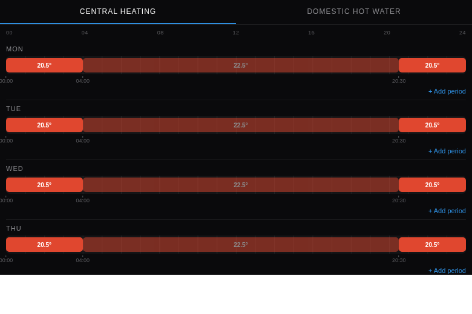

# atag_schedule_card — ATAG ONE Weekly Schedule Editor

A weekly central-heating / hot-water schedule editor styled after the ATAG ONE app's schedule
screen — a 24 h timeline per day with editable temperature periods.

---

## Screenshot



## What it shows

- Tab pair: Central Heating / Domestic Hot Water
- Seven day rows, each a 24 h pill timeline (comfort periods in red, setback in blue)
- Tap a pill to edit its start/end time and temperature, or remove it
- "+ Add period" per day (max 6, matching the ATAG ONE controller's own limit)
- Save writes only the changed periods via the binding's per-period Thing Actions, sequentially
  with a pause between writes (the device firmware requires ≥ 2 s between requests)
- Revert discards unsaved local edits

## Requirements — read this first

This widget needs **two read-only channels the `atagone` binding does not expose yet**
(`heating#schedule` / `hotwater#schedule`, JSON-encoded weekly schedule). Until they exist, the
widget shows an explicit "waiting for binding update" state and Save stays disabled — this is
expected, not a bug. See `atag-binding-schedule-spec.md` in the `openhab-server` repo for the full
requirements spec.

---

## Quick start

### 1. Install the widget

1. Open **Developer Tools → Widgets** in the Main UI sidebar
2. Click **+** → **Code** tab
3. Paste the contents of [`widget.yaml`](widget.yaml)
4. Click **Save**

### 2. Deploy the companion HTML

Upload [`schedule.html`](schedule.html) to `$OPENHAB_CONF/html/atag/schedule.html` (served at
`/static/atag/schedule.html`).

### 3. Add to a page

Add a Custom Widget block, set type to `atag_schedule_card`, and set the **ATAG Thing** and the
two schedule-JSON item props.

---

## Props reference

| Prop | Required | Description |
|------|----------|-------------|
| `thingUID` | Yes | The `atagone:thermostat:...` Thing UID — used to call the per-period schedule Thing Actions |
| `chScheduleItem` | Yes | CH weekly schedule as JSON — `heating#schedule` (pending binding channel) |
| `dhwScheduleItem` | Yes | DHW weekly schedule as JSON — `hotwater#schedule` (pending binding channel) |

## Schedule JSON shape

```json
{
  "baseTemp": 22.5,
  "days": {
    "monday": [ { "start": 360, "end": 1260, "temp": 20.5 } ],
    "tuesday": [], "wednesday": [], "thursday": [], "friday": [], "saturday": [], "sunday": []
  }
}
```

`start`/`end` are minutes since midnight; array order within a day must match the binding's own
`periodIndex` order for `setChSchedulePeriod`/`clearChSchedulePeriod` — see the spec doc.

## Requirements

- OpenHAB 5.x (tested on 5.2.x)
- The `atagone` binding with `heating#schedule`/`hotwater#schedule` channels and the
  `setChSchedulePeriod`/`clearChSchedulePeriod`/`setDhwSchedulePeriod`/`clearDhwSchedulePeriod`
  Thing Actions

---

## Changelog

### Version 1.0.0

- Initial release — builds against the pending schedule channels; shows a "waiting for binding
  update" state until they exist
