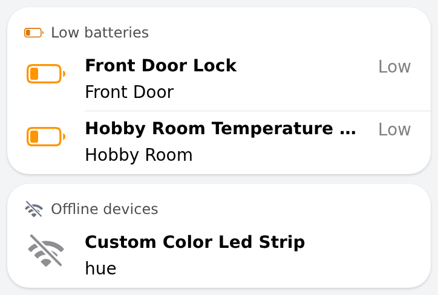

# device_status_card — low batteries and offline devices

Two list cards for the System Info page that only appear when there is something to report: **Low batteries** (members of the battery group that are `ON`, named from the `display` metadata `{device, location}`) and **Offline devices** (Thing status switches that are `OFF`; devices with `offlineExpected` metadata are hidden). Group data is fetched once per page load.

## Props
| Prop | Required | Default | Description |
|---|---|---|---|
| `batteryGroup` | No | `gBatteryWarnings` | Group of low-battery Switch items (ON = low); metadata 'display' {device, location} gives the names. |
| `thingsGroup` | No | `gThingWarnings` | Group of Thing status Switch items (OFF = offline); metadata 'offlineExpected' hides expected-offline devices. |

## Changelog

### Version 1.0.0

- Initial release.
