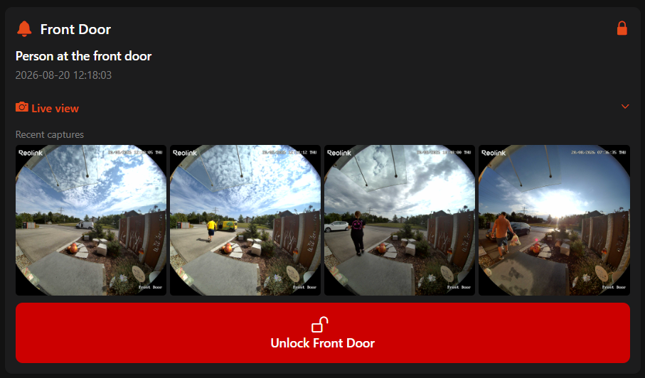
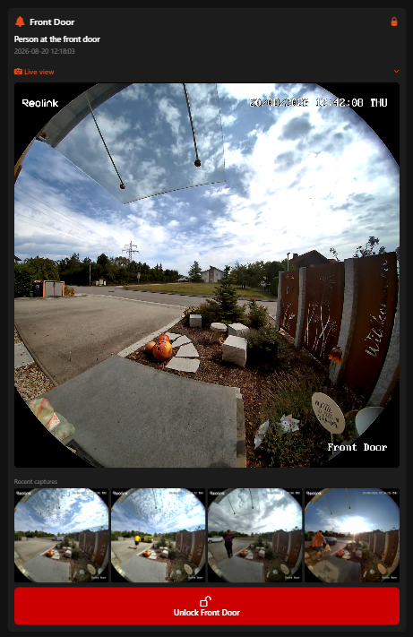

# doorbell_card — IP Camera Doorbell Card

An OpenHAB Main UI card for IP cameras using the [ipcamera binding](https://www.openhab.org/addons/bindings/ipcamera/). Shows the last detection event (person/car badges), a snapshot, a collapsible live HLS stream, and an optional smart lock unlock button.

The snapshot section works in two modes — choose based on your setup:

| Mode | Prop | How it works |
|------|------|-------------|
| **Simple** (default) | `snapshotFolder` not set | Shows latest image via the OH `imageItem` state (ipcamera `image` channel) |
| **4-image history** | `snapshotFolder` set | Shows 4 rotating thumbnails from static JPEG files; requires a snapshot rotation rule |

---

## Screenshots

| Card (4-image history mode) | Live view open |
|------|---------------|
|  |  |

---

## Requirements

- OpenHAB 5.x (tested on 5.2.x)
- [ipcamera binding](https://www.openhab.org/addons/bindings/ipcamera/) with your camera configured as a thing
- **hls.js** placed at `/etc/openhab/html/doorbell/hls.min.js` — required for the live view in browsers that don't natively support HLS (see [Setup §3](#3-set-up-the-live-view))
- Optional: smart lock binding (Nuki, Z-Wave, etc.) for the lock icon and unlock button
- Optional: `widget:keypad` marketplace widget for PIN-code unlock

---

## Setup

### 1. Install the ipcamera binding and configure your camera

In **Settings → Add-ons → Bindings**, install "IP Camera". Add your camera as a thing and note the **Thing UID** (e.g. `abc12345` — the last segment of `ipcamera:REOLINK:abc12345`).

### 2. Create items

Paste [`items/doorbell.items`](items/doorbell.items) into your `.items` file, replacing `YOUR_THING_UID` with the full ipcamera thing UID.

Required items:

| Item | Type | Description |
|------|------|-------------|
| `GF_Entryway_Doorbell_Image` | `Image` | Receives snapshot images |
| `GF_Entryway_Doorbell_LastEventLabel` | `String` | Last detected event description |
| `GF_Entryway_Doorbell_LastEventTime` | `String` or `DateTime` | Timestamp of last event |

Optional:

| Item | Type | Description |
|------|------|-------------|
| `GF_Entryway_Doorbell_HumanDetected` | `Switch` | Person detection state |
| `GF_Entryway_Doorbell_CarDetected` | `Switch` | Car/vehicle detection state |
| Your lock state item | `Switch` | `ON` = locked |

> You can rename the items — just update the widget props accordingly.

### 3. Set up the live view

The live view uses [hls.js](https://github.com/video-dev/hls.js/) to play the ipcamera binding's HLS stream.

1. Download `hls.min.js` from the [hls.js releases](https://github.com/video-dev/hls.js/releases) page
2. Place it at `/etc/openhab/html/doorbell/hls.min.js`
3. Copy `live.html` to `/etc/openhab/html/doorbell/live.html`

Both files must be in the same `/etc/openhab/html/doorbell/` directory. The live view is loaded via `oh-webframe` and polls the ipcamera HLS stream at `/ipcamera/{thingUID}/ipcamera.m3u8`.

### 4. Install the widget

1. Open **Developer Tools → Widgets** in Main UI
2. Click **+** → **Code** tab
3. Paste the contents of [`widget.yaml`](widget.yaml)
4. Click **Save**

### 5. Add to a page

1. Edit a page → drag in a **Custom Widget** block
2. Set widget type to `doorbell_card`
3. Set the required props

---

## Props reference

| Prop | Required | Type | Description |
|------|----------|------|-------------|
| `imageItem` | Yes | Item | Image item receiving camera snapshots |
| `labelItem` | Yes | Item | String item with the last event description |
| `timeItem` | Yes | Item | DateTime/String item with the last event time |
| `cameraThingId` | Yes | Text | ipcamera thing UID — last segment of the Thing UID |
| `humanItem` | No | Item | Switch: ON when a person is detected |
| `carItem` | No | Item | Switch: ON when a car is detected |
| `lockItem` | No | Item | Switch: ON = locked; shows lock icon in header |
| `pinItem` | No | Item | Item for PIN unlock popup (`widget:keypad` required) |
| `cardTitle` | No | Text | Card header label (default: "Front Door") |
| `snapshotFolder` | No | Text | Subfolder under `/etc/openhab/html/` for 4-image history (see below) |

---

## 4-image history mode

When `snapshotFolder` is set, the widget shows four rotating thumbnails (`snapshot.jpg`, `snapshot_1.jpg`, `snapshot_2.jpg`, `snapshot_3.jpg`) from a static folder instead of the single `imageItem` state. Each thumbnail is a tappable full-screen photo.

This requires:
1. A subfolder at `/etc/openhab/html/{snapshotFolder}/` (e.g. `/etc/openhab/html/doorbell/`)
2. A snapshot rotation rule that saves JPEG files into that folder on each event

### Snapshot rotation rule

The rule fires on a camera event, fetches a snapshot via curl, rotates the existing files, and saves the new one. Adapt `SNAP_URL`, `SNAP_DIR`, and the trigger item to your setup.

```javascript
// Snapshot rotation rule — openhab-js
// Triggers on any camera event item changing to ON
// Requires: curl installed, camera reachable at SNAP_URL

const SNAP_DIR = '/etc/openhab/html/doorbell';  // must match snapshotFolder prop
const SNAP_URL = 'http://192.168.0.x/cgi-bin/api.cgi?cmd=Snap&channel=0&rs=snap&user=admin&password=YOUR_PASSWORD';

// Rotate existing files: 2→3, 1→2, current→1
const rotate = () => {
  const fs = Java.type('java.nio.file.Files');
  const Paths = Java.type('java.nio.file.Paths');
  const move = (src, dst) => {
    const s = Paths.get(src), d = Paths.get(dst);
    if (fs.exists(s)) fs.move(s, d, Java.type('java.nio.file.StandardCopyOption').REPLACE_EXISTING);
  };
  move(`${SNAP_DIR}/snapshot_2.jpg`, `${SNAP_DIR}/snapshot_3.jpg`);
  move(`${SNAP_DIR}/snapshot_1.jpg`, `${SNAP_DIR}/snapshot_2.jpg`);
  move(`${SNAP_DIR}/snapshot.jpg`,   `${SNAP_DIR}/snapshot_1.jpg`);
};

// Fetch new snapshot via curl
const fetch = () => {
  const result = actions.Exec.executeCommandLine(
    time.Duration.ofSeconds(5),
    'curl', '-sf', '-o', `${SNAP_DIR}/snapshot.tmp`, SNAP_URL
  );
  const fs = Java.type('java.nio.file.Files');
  const Paths = Java.type('java.nio.file.Paths');
  const tmp = Paths.get(`${SNAP_DIR}/snapshot.tmp`);
  if (fs.exists(tmp) && fs.size(tmp) > 0) {
    fs.move(tmp, Paths.get(`${SNAP_DIR}/snapshot.jpg`),
      Java.type('java.nio.file.StandardCopyOption').REPLACE_EXISTING);
    return true;
  }
  return false;
};

rotate();
if (!fetch()) {
  console.warn('Snapshot fetch failed');
}
```

> **Security note**: if your camera requires authentication, store credentials in a curl config file (`-K /path/to/conf`) rather than in the URL — OpenHAB logs the full command on failure, which would expose the password. See the [curl docs](https://curl.se/docs/manpage.html#-K) for the config file format.

> **HTTPS cameras**: replace the URL scheme with `https://` and add `-k` (skip certificate check) or `--cacert` if needed.

---

## Notes

- **Snapshot (simple mode)**: shown via the `imageItem` OH Image item state, refreshed every 30 s. Updated automatically when the ipcamera binding captures a new image via the `image` channel.
- **Snapshot (history mode)**: files served directly from `/etc/openhab/html/{snapshotFolder}/`. The `timeItem` state is appended as a cache-buster (`?t=...`) so browsers reload on new events.
- **Live view**: the `cameraThingId` prop builds the URL `/ipcamera/{id}/ipcamera.m3u8`. The ipcamera thing must be ONLINE. The live HLS stream includes a stall watchdog (nudges after 8 s, reloads after 20 s).
- **Unlock button**: only appears when `pinItem` is set. Requires the [`widget:keypad`](https://community.openhab.org/t/keypad-widget/122765) marketplace widget.
- **hls.js version**: tested with hls.js 1.5.x.
