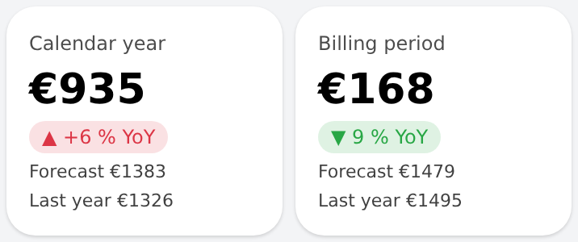

# gas_cost_card — period cost card (gas and electricity)

Full-width card for the Electricity and Gas pages: cost so far in a period, a year-over-year badge (green when cheaper),
the forecast for the end of the period and last year's total. Despite its name it works for any `Number:Currency` item —
the home page uses it for **both** gas and electricity, in calendar-year and billing-period variants. For the compact
half-width home page tile with a live value and trend line see [`cost_glance_tile`](../cost_glance_tile/).

## Props
| Prop | Required | Item type | Meaning |
|---|---|---|---|
| `item` | Yes | `Number:Currency` | Cost so far in the period |
| `yoyItem` | No | `Number` | % vs. the same period last year; green when negative. Empty = no badge |
| `predictedItem` | No | `Number:Currency` | Predicted cost at the end of the period. Empty = hidden |
| `prevTotalItem` | No | `Number:Currency` | Total of the previous period. Empty = hidden |
| `title` | No | text | Label above the value (default "Cost") |

The cost, forecast and YoY items are produced by rules (see the gas / electricity cost docs in the server repo); the widget only displays them.

## Changelog

### Version 1.0.0

- Imported into the repo (existed live only); `Card title` default is now "Cost" (was "Gas – Calendar Year"); card corners 18 px with margin 0 to match the home page cards
