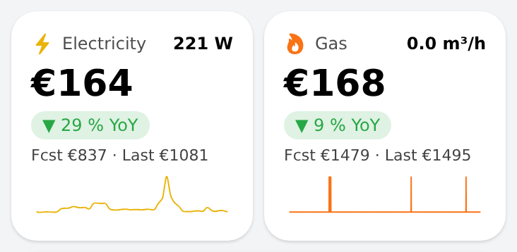
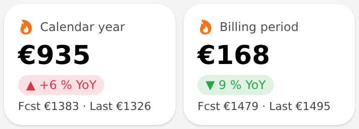

# gas_cost_card — cost card/tile for gas and electricity

Tile for a cost that matters for the bill (half width on the home page, also used on the gas/electricity detail pages): the cost so far in the billing period, a year-over-year
badge (green when cheaper), forecast vs. last period's total, the **current consumption** top right (e.g. `341 W`,
or `0.0 m³/h`) and a 24 h trend line of the live value below. Tap opens a detail page.
Native components only (`oh-link`, `f7-card`, `oh-trend`); place two in one `oh-grid-row` with `oh-grid-col width 50`. Leave `liveItem`/`trendItem` empty for a plain cost card without live value and trend line, and `page` empty for a tile that is not clickable.

## Props
| Group | Prop | Item type | Meaning |
|---|---|---|---|
| Look | `title` (required), `icon`, `color`, `page` | — | Title, f7 icon name, trend/icon colour, target page (`page:<uid>`) |
| Cost data | `costItem` (required) | `Number:Currency` | Cost so far in the period |
| | `yoyItem` | `Number` | % vs. the same period last year; green < 0, red ≥ 0; empty = no badge |
| | `predictedItem` | `Number:Currency` | Forecast at the end of the period; empty = hidden |
| | `prevTotalItem` | `Number:Currency` | Previous period total; empty = hidden |
| Live value | `liveItem` | `Number` (with unit) | Current consumption, shown rounded with its unit |
| | `activeItem`, `idleText` | `Switch`, text | While the switch is OFF the live value reads the idle text (e.g. burner flame → "Burner off") |
| | `liveScale`, `liveUnit` | number, text | Multiplier and unit for the live value, e.g. `60` and `m³/h` to show a per-minute item as hourly flow |
| | `trendSampling` | integer | Use every Nth persisted point for the trend (default 30; lower for spiky items) |
| | `trendItem` | any numeric item | Item for the trend line (default `liveItem`); needs persistence — `oh-trend` reads the default service (24 h, sampled every 30 points) |

Example: electricity = `Shelly_…EnergyBillingPeriod_Cost` (+ `_YoYPercent`, `_Predicted`, `_PrevBillingTotal`) with
`liveItem` = power in W; gas = `…GasUsageLastReading_Cost` with `liveItem` = the gas sensor's consumption per minute
(m³ per minute, derived from the meter counter by a rule), `liveScale` 60 and `liveUnit` m³/h. The trend is spiky, so use
`trendSampling` 1 (the meter reports in 0.1 m³ pulses, so most minutes are 0).

## Changelog

### Version 2.0.0 (BREAKING)

- Rebuilt in the style of the home page tiles (header with icon and title, 26 px cost, YoY pill, forecast/last-year line); works as a half-width tile or a plain cost card
- **Prop `item` renamed `costItem`**; `yoyItem`, `predictedItem`, `prevTotalItem` and `title` are unchanged
- New optional props: `icon`, `color`, `page` (tap target), `liveItem`, `activeItem`, `idleText`, `liveScale`, `liveUnit`, `trendItem`, `trendSampling` — a live value (e.g. W, m³/h) top right and a 24 h trend line; leave them empty for a plain card
- Costs are shown rounded in euro ("€935") and forecast and last year share one line ("Fcst €1383 · Last €1326")
- Corners 18 px, margin 0; `title` defaults to "Cost"; used for both gas and electricity

### Version 1.0.0

- Imported into the repo (existed live only); `Card title` default is now "Cost" (was "Gas – Calendar Year"); card corners 18 px with margin 0 to match the home page cards
