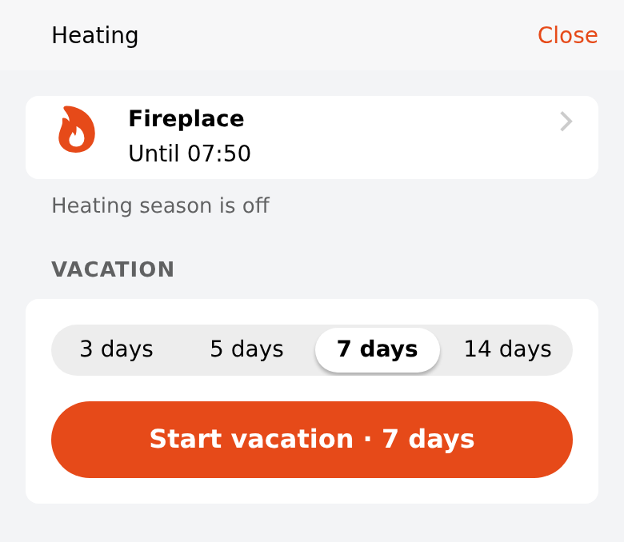

# home_heating_quick — heating quick-mode sheet

Bottom sheet for the one-tap heating modes: **Fireplace** until the next morning (07:00), **Vacation** for
3 / 5 / 7 / 14 days, and **Back to Auto** (only shown while a timed mode runs). A status line shows the current mode.
Native list rows, segmented control and button only.

Open it from a tile: `action: sheet`, `actionModal: widget:home_heating_quick` (no `actionModalConfig` needed when
the prop defaults fit; prop defaults apply inside sheets).

## Props
| Prop | Item type | Meaning |
|---|---|---|
| `commandItem` | `String` (no channel; `autoupdate=false` recommended) | Receives `fireplacemorning`, `vacation<days>`, `cancel` — a rule turns these into thermostat actions |
| `modeItem` | `String` | Heating mode: `auto`, `manual`, `fireplace`, `holiday`, `extend` (atagone `ch_mode`) |
| `targetItem` | `Number` | Current target temperature, shown in automatic mode |
| `seasonItem` | `Switch` | `ON` = heating season (distinguishes "Manual mode" from "Heating season is off") |

## Why a rule
ATAG ONE fireplace / vacation / extend modes exist only as Thing Actions (`activateFireplace(seconds)`,
`activateVacation(seconds)`, `activateExtend(seconds)`, `cancelMode()`), not as channels. The widget therefore sends
a plain command and [`rules/set-heating-mode.js`](rules/set-heating-mode.js) (optional example — set `THING` and
`MODE_ITEM`) maps it to the actions. `cancel` is ignored unless a timed mode runs, because `cancelMode()` in manual
mode switches the boiler back to its schedule.

## Changelog
### Version 1.0.0

- Initial release.
