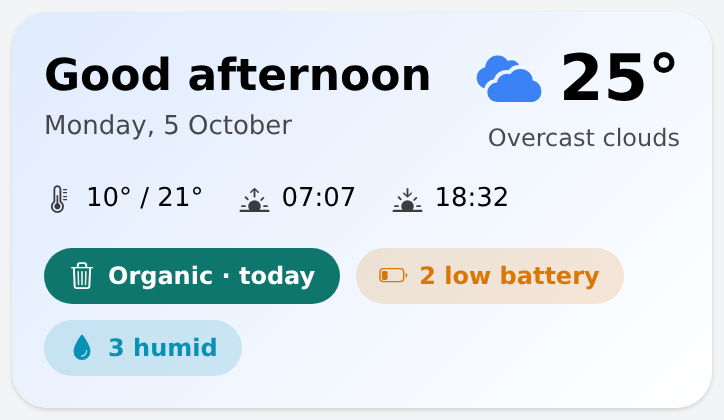

# home_hero — home page hero card

Greeting (Good morning / afternoon / evening / night + date), weather (day/night icon, current temperature,
condition), today's min/max and sunrise/sunset, and an exception-driven alert chip row (see
`home_hero_alerts`, see below). Everything is configurable through props with this house's items as
defaults, so a page needs no config: add `widget:home_hero` in a full-width grid column.

## Props
| Group | Prop | Default | Description |
|---|---|---|---|
| Weather | `tempItem` | `Netatmo_Weather_Station_Outdoor_Temperature` | Current outdoor temperature |
| | `conditionItem` | `OpenWeatherMap_Forecast_API_Current_Condition` | Condition text |
| | `iconItem` | `…Forecasts_ForecastToday_Iconid` | OWM icon id (`03d`); day/night variant is chosen from sunrise/sunset |
| | `minItem` / `maxItem` | `…ForecastToday_Min/Maxtemperature` | Today's range |
| | `sunriseItem` / `sunsetItem` | `LocalSun_Rise_Start` / `LocalSun_Set_Start` | DateTime items |
| Behaviour | `weatherPage` | Outdoor page | Opened when the weather block (or a warning chip) is tapped |
| | `showSunTimes` | `true` | Show sunrise/sunset |
| | `name` | empty | Appended to the greeting |
| Doorbell | `doorbellLabelItem`, `doorbellTimeItem`, `doorbellCamera`, `doorbellMinutes` | `GF_Entryway_Doorbell_LastEventLabel`, `…_LastEventTime`, `ipcamera:reolink:f2c0eb4ea2`, `10` | Chip "Person at the front door · 3 min ago" for N minutes after an event; tap opens `doorbell_live` (popup, from the doorbell_card family). Empty time item = no chip |
| Alerts | `smokeGroup`, `weatherWarningsGroup`, `batteryGroup`, `humidityGroup`, `thingsGroup`, `pickupsGroup` | `gSmokeAlerts`, `gWeatherWarnings`, `gBatteryWarnings`, `gHumidityWarnings`, `gThingWarnings`, `gWastePickups` | Passed to `home_hero_alerts` |

Look and feel (colours, chip order, greeting hours) is deliberately not configurable.

## Widget family — install all of these together
One logical widget, five definitions, all in [`widgets.yaml`](widgets.yaml) (openHAB's multi-widget `widgets:` map
format; each key is the widget UID). Main UI has no include mechanism and bottom sheets must be separate widgets. In the
widget editor create one widget per key (UID = key) and paste that entry's body. Only `home_hero` is placed on a page.

| UID | Role |
|---|---|
| `home_hero` | the card (place this one) |
| `home_hero_alerts` | chip row |
| `home_offline_devices` | offline sheet |
| `home_low_batteries` | battery sheet |
| `home_humidity` | humidity sheet |

Also needs the waste widgets (`waste_pickup_chips`, `waste_pickup_schedule`, `waste_pickup_row`) from
[`../waste_pickup_card/`](../waste_pickup_card/) and the live view popup `doorbell_live` from
[`../doorbell_card/`](../doorbell_card/) (used by the doorbell chip). On the page give the entry a `config` object
(`{}` is enough) or the editor shows no props.

## How it fits together
`home_hero` embeds `home_hero_alerts` (the chip row). Chips open bottom sheets: `home_low_batteries`, `home_humidity`,
`home_offline_devices` and, for waste, `waste_pickup_schedule`; the doorbell chip opens the `doorbell_live` popup. The
chips' data is prefetched with the page, so sheets open instantly. Chips and rows render through repeaters, so the page
editor shows exactly the chips that are currently active instead of every variant.

## Changelog

### Version 1.3.0

- Shorter chips: the icon says what it is, so smoke, batteries, humidity and offline chips show only the icon and a count (`🔋 2`); the doorbell chip is `Label · now / N min` (the event label is the information, "ago" dropped). The weather warning and waste chips keep their text because the text is the content. Tap targets and sheets are unchanged

### Version 1.2.0

- The humidity chip and its sheet only show **critical** humidity (above the per-item red threshold, chip in red). Elevated humidity no longer raises a chip — it only needs action when it stays elevated, which the threshold alert rules handle

### Version 1.1.0

- Doorbell chip: shows the last doorbell event for `doorbellMinutes` after it happened (new Doorbell props); tap opens the `doorbell_live` popup
- Editor-safe: chips are rendered through repeaters instead of `visible`, so the page editor shows only the active chips (no stacked duplicates)
- Metrics row (min/max, sunrise, sunset) left-aligned; card corners 18 px to match the other home page cards

### Version 1.0.0

- Initial release: greeting, weather, min/max and sun times; alert chips in urgency order (smoke, weather warnings, waste, batteries, humidity, offline) with detail sheets; every item and group is a prop
