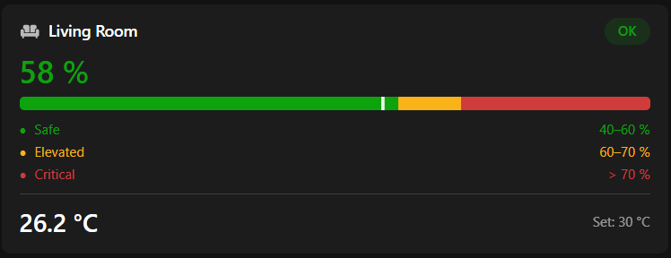

# humidity_room_card — Per-Room Humidity & Temperature Card

A compact OpenHAB Main UI widget that shows a room's current humidity with a colour-coded status badge, a zone bar visualising the safe/elevated/critical thresholds, and the current temperature and setpoint.

---

## Screenshot

## What it shows

- Room icon + name + **OK / Elevated / Critical** badge (green / amber / red)
- Large humidity value, colour-coded by threshold
- CSS gradient zone bar with a live position indicator
- Three-row legend: Safe · Elevated · Critical with configurable ranges
- Current temperature and thermostat setpoint (optional)
- Tapping the card opens the Analyzer for the humidity and temperature items

---

## Quick start

### 1. Install the widget

1. Open **Developer Tools → Widgets** in the Main UI sidebar
2. Click **+** → **Code** tab
3. Paste the contents of [`widget.yaml`](widget.yaml)
4. Click **Save**

### 2. Add to a page

1. Edit a page → drag in a **Custom Widget** block
2. Set the widget type to `humidity_room_card`
3. Set the **Humidity Item** prop to your humidity item name
4. Optionally set a room name, icon, and threshold values

---

## Props reference

| Prop | Required | Default | Description |
|------|----------|---------|-------------|
| `item` | Yes | — | Humidity item (e.g. `FF_KidsRoom_Climate_Humidity`) |
| `tempItem` | No | — | Temperature item |
| `setpointItem` | No | — | Thermostat setpoint item |
| `title` | No | item label | Room display name |
| `icon` | No | `f7:house` | Icon name (e.g. `iconify:mdi:sofa`) |
| `min` | No | `40` | Safe zone upper bound (%) displayed in legend |
| `orange` | No | `60` | Elevated threshold — above this is amber (%) |
| `red` | No | `70` | Critical threshold — above this is red (%) |

---

## Requirements

- OpenHAB 5.x (tested on 5.2.x)
- A Number or Number:Dimensionless humidity item (0–100 % or 0–1 ratio both accepted)

---

## Changelog

### 1.0.2
- Fix: zone bar not rendering in some Main UI versions — replaced empty `Label` with `f7-block` (empty-text Labels are silently suppressed in certain OH releases)
- Improvement: props reorganised into Sensor Items / Appearance / Thresholds groups; threshold labels clarified (Safe max / Elevated max / Critical from)

### 1.0.1
- Explicit `tempItem` and `setpointItem` props — no more implicit `_Humidity` → `_ActualTemperature` name derivation
- Props grouped under "Sensor Items" (humidity first, then temperature, setpoint) at the top of the settings panel
- Humidity normalisation: accepts both 0–100 % and 0–1 dimensionless ratio sensors
- Bar indicator position uses `parseFloat(state)` instead of `numericState` for consistent behaviour across item types

### 1.0.0
- Initial release
