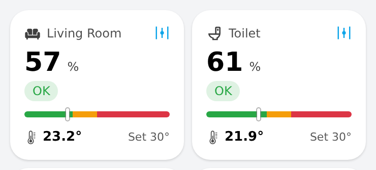

# humidity_room_card — Per-Room Humidity & Temperature Tile

Half-width tile in the shared page design: room icon and name, humidity as a 26 px value in its status colour, an **OK / Elevated / Critical** pill, a slim zone bar with a position marker, and temperature plus thermostat setpoint. Place two per row.

## What it shows

- Room icon + name; optional heating-valve icon (blue = any valve open, dim = all closed)
- Humidity value coloured green / amber / red by the thresholds, with the status pill
- Zone bar from `min` to `max` (default 20–80 %, so 50 % is the middle; safe / elevated / critical) with the current position
- `22.9 °C · Set 30 °C` sub line
- Tapping the tile opens the analyzer for the humidity, temperature, setpoint and valve items

## Install and use

1. Developer Tools → Widgets → **+** → **Code** → paste [`widget.yaml`](widget.yaml) → **Save**
2. In a page, in an `oh-grid-col width 50` (padding 4 px), add a Custom Widget `humidity_room_card` and set the **Humidity Item**

## Props

| Prop | Required | Default | Description |
|------|----------|---------|-------------|
| `item` | Yes | — | Humidity item (0–100 % or 0–1 ratio) |
| `tempItem` | No | — | Temperature item |
| `setpointItem` | No | — | Thermostat setpoint item |
| `title` | No | item label | Room display name |
| `icon` | No | `f7:house` | Icon id (e.g. `iconify:mdi:sofa`) |
| `min` | No | `20` | Left end of the zone bar (%) |
| `max` | No | `80` | Right end of the zone bar (%); higher values are pinned to the end |
| `orange` | No | `60` | Elevated above this (%) |
| `red` | No | `70` | Critical above this (%) |
| `valveItems` | No | — | Comma-separated heating valve `_STATE` switches for the valve icon |

## Requirements

- OpenHAB 5.x (tested on 5.2.x)
- A Number or Number:Dimensionless humidity item

---

## Changelog

### Version 2.2.0

- Zone bar scale is now 20–80 % (new prop `max`, `min` default 40 → 20) instead of 40–100 %: with tight per-room levels the old scale made the green zone a third of the bar and the red zone more than half; 50 % is now the middle of the bar

### Version 2.1.0

- Humidity value and icon in the normal text colour — status is shown by the pill and the zone bar only
- Temperature line: thermometer icon with the current temperature, "Set 30°" muted on the right

### Version 2.0.0 (BREAKING)

- Rebuilt as a half-width tile in the shared page design (18 px card, 26 px value, status pill, slim zone bar, sub line)
- **Prop `compact` removed** — the threshold legend is gone from the tile (show one legend line per page instead)
- The valve icon no longer shows a count badge

### Version 1.2.2

- Reverted the 1.2.1 desktop-responsive `compact` behavior — `window.innerWidth` in a widget
  `visible:` expression didn't reliably hide the legend on narrow screens in production (it
  showed at every width tested). `compact` is back to a plain, unconditional toggle exactly as
  in 1.2.0 (`true` always hides the legend, `false` always shows it), until a reliable
  per-viewport signal is available in this expression context. Pages that want the legend
  visible everywhere (the common case, since responsive hiding isn't available) should set
  `compact:false` explicitly.

### Version 1.2.1

- `compact` now only hides the legend below 768px viewport width (`window.innerWidth`). On
  desktop-width screens the legend always shows, even with `compact:true` set, since there's
  room for it there and it's useful reference (the exact Safe/Elevated/Critical % ranges).

### Version 1.2.0

- Added optional `compact` prop — hides the Safe/Elevated/Critical legend rows so cards can sit
  two-per-row on narrow (phone-width) layouts without the legend repeating for every card

### Version 1.1.1

- The v1.1.0 header alignment fix (below) turned out to be incomplete — Framework7's `.col` grid
  class was still fighting the `margin-left: auto` override in some cases. Fixed by pulling the
  badge/valve-icon/count-label out of their wrapping `f7-col` entirely (now plain row children,
  with `margin-left: auto` on the first) rather than trying to override `.col` from inside it

### Version 1.1.0

- Added optional `valveItems` prop — a small header icon (blue = any configured valve item is
  `ON`, dim = all closed) with a count badge when more than one item is given. States only
  whether the valve is open, deliberately — not whether the room is "heating" (a room can sit at a
  parked-open setpoint with the boiler off for most of the year, so that inference would be wrong
  most of the time)
- Fix: the header row now sets an explicit `width: 100%` — without it, the row shrink-wraps to its
  own content width instead of stretching to the card's full inner width, so the room-name column's
  `flex: "1"` has no free space to grow into and the trailing badge/valve group sits stranded
  mid-card instead of flush right. Badge and valve icon are now one merged flex group (was two
  separate columns) so they stay adjacent regardless of title length
- All six existing prop combinations render identically to v1.0.4 aside from the alignment fix —
  `valveItems` is additive and optional

### Version 1.0.4

- Fix: zone bar still not rendering when `orange`/`red` props were undefined on existing widget instances — gradient expression now uses `(props.orange||60)` / `(props.red||70)` defensive defaults so the CSS is always valid
- Fix: YAML parse error in `setpointItem` description (`: ` inside an unquoted scalar misread as a YAML mapping separator) — description now single-quoted
- Use `text: " "` (non-breaking space) on the zone bar Label to prevent silent suppression in OH releases that skip empty-text Labels

### Version 1.0.3

- Fixed `min` prop label: "Safe max (%)" → "Safe Min (%)" — it is the lower bound of the safe zone, not the upper
- Added descriptions to Humidity Item, Temperature Item, and Setpoint Item props

### Version 1.0.2

- Fix: zone bar not rendering in some Main UI versions — replaced empty `Label` with `f7-block` (empty-text Labels are silently suppressed in certain OH releases)
- Improvement: props reorganised into Sensor Items / Appearance / Thresholds groups; threshold labels clarified (Safe max / Elevated max / Critical from)

### Version 1.0.1

- Explicit `tempItem` and `setpointItem` props — no more implicit `_Humidity` → `_ActualTemperature` name derivation
- Props grouped under "Sensor Items" (humidity first, then temperature, setpoint) at the top of the settings panel
- Humidity normalisation: accepts both 0–100 % and 0–1 dimensionless ratio sensors
- Bar indicator position uses `parseFloat(state)` instead of `numericState` for consistent behaviour across item types

### Version 1.0.0

- Initial release
