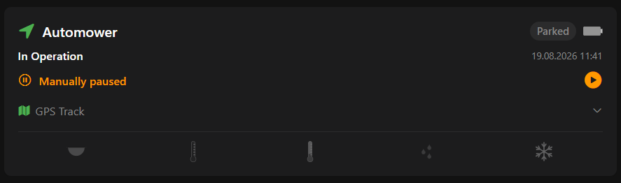
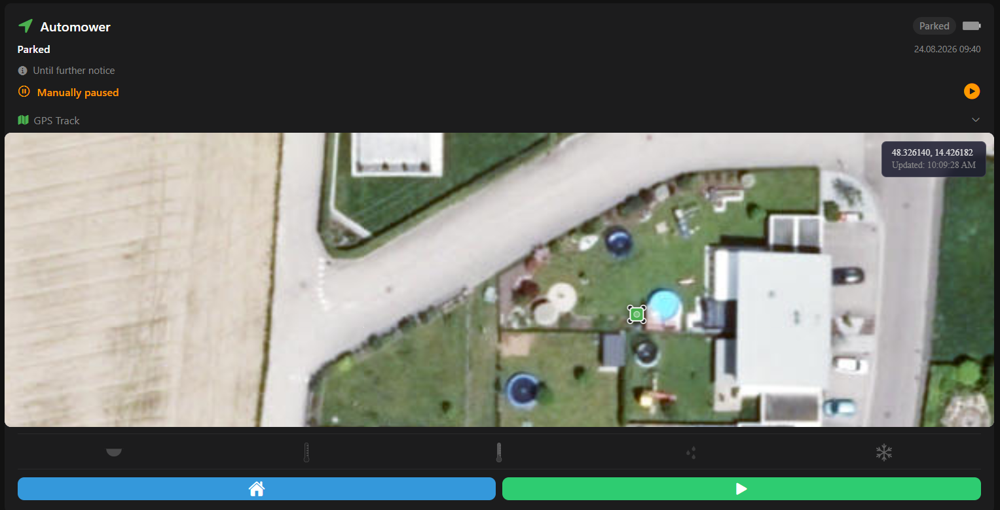

# lawn_mower — Husqvarna Automower Status Card

A custom OpenHAB Main UI widget that shows your Husqvarna Automower's real-time status, GPS track map, weather guard indicators, and a manual pause button — all in one card.

> **Husqvarna Automower only.** This widget relies on activity strings (`MOWING`, `LEAVING`), error codes (0–12, 110), and Thing actions (`parkUntilFurtherNotice()` / `resumeSchedule()`) that are specific to the [Husqvarna Automower binding](https://www.openhab.org/addons/bindings/automower/). It does not support other smart lawn mowers.

---

## Screenshots

> Add screenshots to `widgets/lawn_mower/screenshots/` and update these links.

| Collapsed | GPS map open |
|-----------|-------------|
|  |  |

## What it shows

The card shows:
- Activity badge (green = mowing/leaving, grey = idle/parked, red = error)
- Error code expanded to a human-readable message
- Battery level (tap opens the Analyzer)
- Last-update timestamp
- Manual pause toggle (optional)
- Collapsible GPS track map (optional — requires companion HTML file)
- Weather guard icon strip (optional — shows active/inactive guards)

---

## Tier 1 — Basic Setup

Paste the widget, wire five items from your automower binding channels, done.

### 1. Install the widget

1. Open **Developer Tools → Widgets** in the Main UI sidebar
2. Click **+** → **Code** tab
3. Paste the contents of [`widget.yaml`](widget.yaml)
4. Click **Save**

### 2. Wire binding channels

In **Settings → Things**, open your automower thing. Copy the Thing UID (e.g. `automower:automower:abc123:am415x`). Create these items linked to the corresponding channels:

| Item type | Channel | Widget prop |
|-----------|---------|-------------|
| `String` | `status#activity` | `automowerActivity` |
| `String` | `status#state` | `automowerStatus` |
| `Number` | `status#error-code` | `automowerErrorCode` |
| `Number` | `status#battery` | `automowerBatteryLevel` |
| `DateTime` | `status#last-update` | `automowerLastUpdate` |

See [`items/automower.items`](items/automower.items) for a ready-to-paste `.items` file.

### 3. Add the widget to a page

1. Edit a page → drag in a **Custom Widget** block
2. Set the widget type to `lawn_mower`
3. Fill in the five required props with your item names

That's it. The card shows live status with error decoding.

### Optional: GPS track map

The collapsible map accordion requires a companion HTML file served by OpenHAB's built-in web server.

1. Copy [`automower-map.html`](automower-map.html) to `/etc/openhab/html/automower-map.html`
2. Create a `Location` item linked to `status#position`
3. Set the widget's **Automower Position** prop to that item name
4. Set the widget's **Persistence Service** prop to your persistence service ID (e.g. `influxdb`)

> **Important:** The GPS track history requires a persistence service that supports the OpenHAB `Location` item type. RRD4J (the OpenHAB default) only stores numeric types and cannot store Location items — the map will show no track history. Use InfluxDB or another service that persists Location items and configure its service ID in the **Persistence Service** prop.

The map live-polls the mower's current position every 30 seconds regardless of persistence, so the current position marker always works. Only the today's track history requires persistence.

### Optional: simple manual pause

To add a pause toggle directly bound to the binding:

1. Create a `Switch` item linked to `command#pause`
2. Set the widget's **Manual Pause** prop to that item name

This pauses the mower in-place via the binding but does not interact with any schedule automation.

---

## Tier 2 — Full Automation (Weather Guards + Manual Pause)

Use a NAND group so that weather guard rules and a manual pause all feed into one schedule control item. The widget prop strip shows which guards are currently active.

### How the NAND group works

`Group:Switch:NAND(OFF,ON)` — group is **OFF** when **any** member is ON, and **ON** only when **all** members are OFF.

- Guard items (weather, darkness, frost…) go ON → group goes OFF → schedule rule parks the mower
- All guards go OFF → group goes ON → schedule rule resumes the schedule (unless it's a weekend)

### 1. Create the items

Paste [`items/automower.items`](items/automower.items) into your `.items` file. The file defines:
- The five required status items
- A `Location` item for the GPS map
- A `Group:Switch:NAND(OFF,ON)` named `AutomowerSchedule`
- Six member Switch items (dark, hot, cold, frost, rain, manual)

### 2. Create the schedule rule

1. Open **Settings → Rules → +** → name it "Automower Schedule"
2. Add trigger: **Item AutomowerSchedule changed**
3. Set action type to **Run Script** → **ECMAScript 262 Edition 11** (JS Scripting)
4. Paste the contents of [`rules/automower-schedule.js`](rules/automower-schedule.js) and replace `THING_UID` with your Thing UID

### 3. Create weather guard rules (Threshold Alert)

Install the **Threshold Alert** template from the [OpenHAB Marketplace](https://community.openhab.org/) (search "Threshold Alert", template ID `144863`).

For each guard you want, create a rule from the template. In the template's action script, set the corresponding guard item:

| Guard | Trigger item | Guard item | Suggested threshold |
|-------|-------------|------------|---------------------|
| High temp | Outdoor temperature | `Automower_Guard_Hot` | > 35 °C |
| Low temp | Outdoor temperature | `Automower_Guard_Cold` | < 5 °C |
| Frost | Outdoor temperature | `Automower_Guard_Frost` | < 2 °C |
| Rain | Rain sensor / forecast | `Automower_Guard_Rain` | > 0 mm |

Example action script for each Threshold Alert rule:
```javascript
var GUARD_ITEM = 'Automower_Guard_Hot'; // ← change per guard

if (isAlerting) {
  items.getItem(GUARD_ITEM).postUpdate('ON');
} else {
  items.getItem(GUARD_ITEM).postUpdate('OFF');
}
```

For darkness/night: create an Astro binding item linked to `astro:sun:local:set#event` (or use a `isDaylight` Switch) and feed it into `Automower_Guard_Dark`.

### 4. Configure widget props

In the widget config, set:

| Prop | Item |
|------|------|
| Automower Activity | `Automower_Activity` |
| Automower Status | `Automower_State` |
| Automower Error Code | `Automower_ErrorCode` |
| Automower Battery Level | `Automower_Battery` |
| Automower Last Update | `Automower_LastUpdate` |
| Automower Position | `Automower_Position` (if using map) |
| Manual Pause | `Automower_Guard_Manual` |
| Darkness | `Automower_Guard_Dark` |
| High Temperature | `Automower_Guard_Hot` |
| Low Temperature | `Automower_Guard_Cold` |
| Rain | `Automower_Guard_Rain` |
| Frost | `Automower_Guard_Frost` |

The weather guard icon strip is hidden when none of the guard props are set.

---

## Props reference

| Prop | Required | Default | Description |
|------|----------|---------|-------------|
| `automowerActivity` | Yes | — | String item: `status#activity` channel |
| `automowerStatus` | Yes | — | String item: `status#state` channel |
| `automowerErrorCode` | Yes | — | Number item: `status#error-code` channel |
| `automowerBatteryLevel` | Yes | — | Number item: `status#battery` channel |
| `automowerLastUpdate` | Yes | — | DateTime item: `status#last-update` channel |
| `automowerPosition` | No | — | Location item: `status#position` channel (GPS map) |
| `persistenceService` | No | OH default | Persistence service ID for GPS track history (e.g. `influxdb`). Must support Location items — RRD4J does not. |
| `automowerManualPause` | No | — | Switch item for manual pause |
| `isDark` | No | — | Switch item: ON when dark/night |
| `isHot` | No | — | Switch item: ON when too hot |
| `isCold` | No | — | Switch item: ON when too cold |
| `isRaining` | No | — | Switch item: ON when raining |
| `isFrost` | No | — | Switch item: ON when frost |

---

## Requirements

- OpenHAB 5.x (tested on 5.2.x)
- [Husqvarna Automower binding](https://www.openhab.org/addons/bindings/automower/)
- JS Scripting add-on (for the schedule rule, Tier 2 only)
- A persistence service that supports `Location` items, e.g. InfluxDB (for the GPS track map, optional — see note above)

---

## Changelog

### 1.1.0
- Added **Persistence Service** prop — dropdown selector (InfluxDB, RRD4J, MapDB, JDBC, or OpenHAB default) for the GPS track history service; passed to `automower-map.html` as `?serviceId=` URL parameter
- Reorganized widget props into three groups: **Binding Channels**, **GPS Track Map**, and **Schedule & Weather Guards**
- Improved prop labels and descriptions throughout
- GPS map setup docs updated to explain that RRD4J does not support Location items

### 1.0.0
Initial release.
