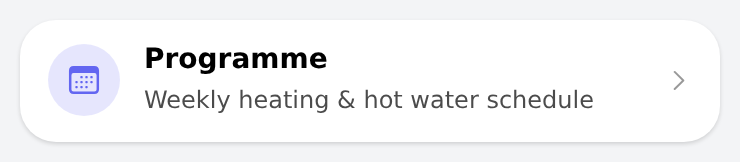

# nav_tile — navigation / action row

One full-width row in the page design: tinted round icon badge, title, subtitle and a chevron. Replaces the large centred
`oh-label-card` links. Actions: navigate to a page, open a popup/sheet/popover widget (with `modalConfig`), open a URL, show an image in
the photo viewer (`photoUrl`), or send a command to an item with an optional confirmation dialog (`item`, `command`, `confirmation`).

## Props
| Prop | Required | Default | Description |
|---|---|---|---|
| `title` | Yes | — | Row title. |
| `subtitle` | No | — | Optional second line (12 px, 70 % opacity). |
| `icon` | No | `chevron_right_circle` | f7 icon name. |
| `color` | No | `#0ea5e9` | CSS colour of the icon badge. |
| `action` | No | `navigate` | navigate (default), popup, sheet, popover or url. |
| `page` | No | — | Target page for navigate (page:<uid>). |
| `modal` | No | — | Target of popup/sheet/popover (widget:<uid> or page:<uid>). |
| `modalConfig` | No | — | Props handed to the popup/sheet widget (object). |
| `url` | No | — | Target of the url action. |
| `photoUrl` | No | — | Image URL shown in the photo viewer (action photos) — e.g. a radar loop. |
| `item` | No | — | Item that receives the command (action command). |
| `command` | No | — | Command sent to the item, e.g. ON. |
| `confirmation` | No | — | Ask for confirmation with this text before sending the command. |
| `feedback` | No | — | Text shown after the command was sent. |

## Changelog

### Version 1.0.0

- Initial release.
