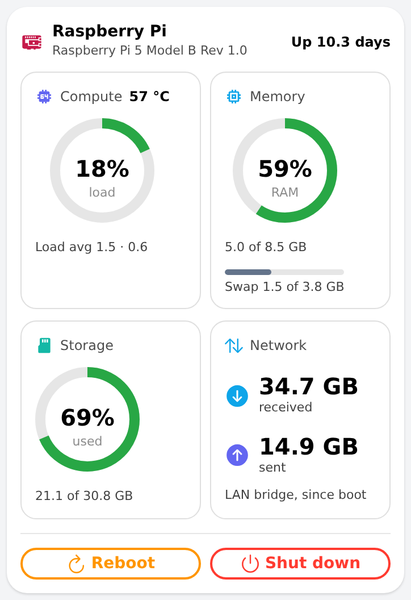

# server_status_card — server hardware status

One grouped card for the machine openHAB runs on, organised by layer: **Compute** (CPU load ring, CPU temperature, load average),
**Memory** (RAM ring, swap bar nested under it), **Storage** (used ring with used/total GB), **Network** (data received/sent since boot),
and the **controls** Reboot and Shut down. The header shows the hardware model and the uptime. The rings go green → amber above 70 % → red above 85 %.

Native components only (`f7-gauge`, `f7-card`, `oh-button`); optional parts (the two buttons) render through repeaters. Reboot and shutdown send `ON` to exec
switch items and always ask for confirmation first — shutdown needs physical access to start again; leave `rebootItem` / `shutdownItem` empty to hide a button.

Items come from the openHAB `systeminfo` binding. Note that the binding's default `network` channel group may map to an idle bridge (e.g. a container bridge);
link the data sent/received items to the channel group of your real interface.

## Props
| Prop | Default | Description |
|---|---|---|
| `title` | `Raspberry Pi` | Card title (default Raspberry Pi). |
| `modelItem` | `Systeminfo_CPUName` | String item with the hardware name, e.g. Raspberry Pi 5 Model B. |
| `uptimeItem` | `Systeminfo_System_Uptime` | Number:Time item (days). |
| `cpuLoadItem` | `Systeminfo_CPULoad` | Number (%) — ring. |
| `cpuTempItem` | `Systeminfo_CPU_Temperature` | Number:Temperature (°C); amber above 70, red above 80. |
| `load1Item` | `Systeminfo_Load1_Average` | Number. |
| `load15Item` | `Systeminfo_Load15_Average` | Number. |
| `memUsedPctItem` | `Systeminfo_Used_` | Number (%) — ring. |
| `memUsedItem` | `Systeminfo_Used` | Number:DataAmount (bytes). |
| `memTotalItem` | `Systeminfo_Total` | Number:DataAmount (bytes). |
| `swapUsedItem` | `Systeminfo_SwapUsed` | Number:DataAmount (bytes). |
| `swapTotalItem` | `Systeminfo_SwapTotal` | Number:DataAmount (bytes). |
| `storageUsedPctItem` | `Systeminfo_UsedStorage_` | Number (%) — ring. |
| `storageUsedItem` | `Systeminfo_UsedStorage` | Number:DataAmount (bytes). |
| `storageTotalItem` | `Systeminfo_Total_Storage` | Number:DataAmount (bytes). |
| `rxItem` | `Systeminfo_Data_Received` | Number:DataAmount (bytes since boot). |
| `txItem` | `Systeminfo_Data_Sent` | Number:DataAmount (bytes since boot). |
| `rebootItem` | `gSystem_Reboot` | Exec switch; ON reboots the server (with confirmation). Empty = no button. |
| `shutdownItem` | `gSystem_Shutdown` | Exec switch; ON powers the server off (with confirmation). Empty = no button. |

## Changelog

### Version 1.0.0

- Initial release. Replaces the single status tiles on the System Info page with one semantically grouped card.
