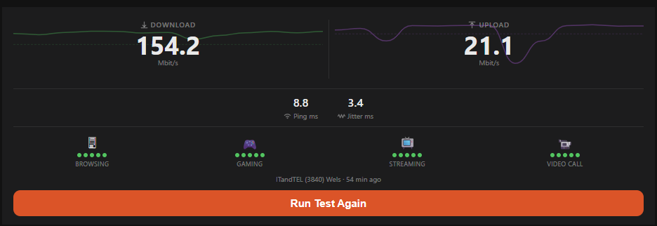

# speedtest_card — Ookla Speedtest Dashboard

An Ookla-inspired OpenHAB Main UI widget powered by the official [Ookla Speedtest binding](https://www.openhab.org/addons/bindings/speedtest/). Shows download/upload speeds with 7-day sparkline trends, ping/jitter, four quality indicators (Browsing, Gaming, Streaming, Video Call), and a "Run Test Again" button.

The widget is a thin `oh-webframe` wrapper around a companion HTML file (`speedtest.html`). All rendering, data fetching, and the run-test flow happen inside the HTML file via the OpenHAB REST API — no additional rules or scripts are needed.

---

## Screenshots

| Widget |
|--------|
|  |

---

## Requirements

- OpenHAB 5.x (tested on 5.2.x)
- [Ookla Speedtest binding](https://www.openhab.org/addons/bindings/speedtest/) installed and configured
- The `speedtest` CLI binary present on the host and GDPR accepted (the binding calls it)
- InfluxDB (or another persistence service) — needed to populate the 7-day sparklines; without it the widget still works but sparklines will be empty

---

## Setup

### 1. Install the Speedtest binding

In **Settings → Add-ons → Bindings**, search for "Ookla Speedtest" and install it.

Once installed, add a new **Ookla Speedtest** thing and note the **Thing UID** (e.g. `speedtest:speedtest:79e16ff6c8`).

### 2. Create items and wire channels

Paste [`items/speedtest.items`](items/speedtest.items) into your `.items` file, replacing `YOUR_THING_UID` with your actual Thing UID.

The widget expects these exact item names:

| Item | Type | Channel |
|------|------|---------|
| `SpeedtestResultDown` | `Number:DataTransferRate` | `downloadBandwidth` |
| `SpeedtestResultUp` | `Number:DataTransferRate` | `uploadBandwidth` |
| `SpeedtestResultPing` | `Number:Time` | `pingLatency` |
| `SpeedtestResultJitter` | `Number:Time` | `pingJitter` |
| `SpeedtestServer` | `String` | `server` |
| `SpeedtestResultDate` | `DateTime` | `timestamp` |
| `SpeedtestRerun` | `Switch` | `triggerTest` |

### 3. Deploy the companion HTML file

Copy `speedtest.html` to your OpenHAB static asset folder:

```bash
cp speedtest.html /etc/openhab/html/speedtest.html
```

The file will be served at `/static/speedtest.html`.

### 4. Install the widget

1. Open **Developer Tools → Widgets** in Main UI
2. Click **+** → **Code** tab
3. Paste the contents of [`widget.yaml`](widget.yaml)
4. Click **Save**

### 5. Add the widget to a page

1. Edit a page → drag in a **Custom Widget** block
2. Set the widget type to `speedtest_card`
3. Set **Download plan** and **Upload plan** to your contracted speeds (default: 150/20 Mbit/s)

The degradation indicator ("−X% below plan") only appears when speed drops below your plan speed.

---

## Props reference

| Prop | Type | Default | Description |
|------|------|---------|-------------|
| `planDown` | `DECIMAL` | `150` | Contracted download speed in Mbit/s |
| `planUp` | `DECIMAL` | `20` | Contracted upload speed in Mbit/s |

---

## How it works

- **Sparklines**: fetches the last 7 days of history via the OpenHAB persistence REST API (uses whatever service your installation is configured with), downsamples to 14 half-day buckets, and renders a smooth bezier curve. The dashed line marks your plan speed.
- **Quality scores**: 5-dot indicators derived from download (Browsing, Streaming), ping (Gaming), and upload (Video Call) using Ookla's published thresholds.
- **Degradation**: nothing shown when at or above plan speed; amber "−X% below plan" at 80–99%; red below 80%.
- **Run Test Again**: POSTs `ON` to `SpeedtestRerun`, polls every 5 seconds until the binding resets it to `OFF`, then refreshes the display.
- **Auto-refresh**: the widget refreshes automatically every 5 minutes.

---

## Changelog

### 1.0.0
Initial release.
