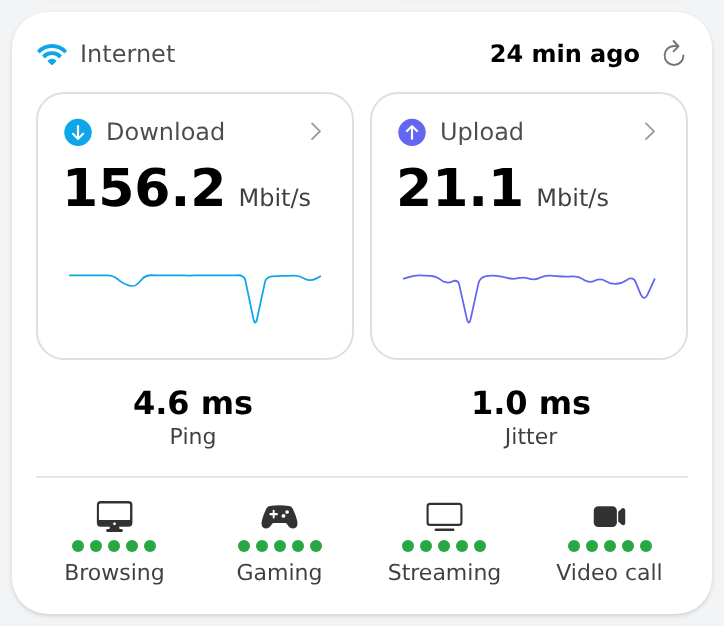

# speedtest_card — Ookla Speedtest card



One widget, one grouped card in the style of the home page cost tiles: a header (title, age of the last test, refresh
icon), two outlined inner tiles for download and upload (a small › marks them as tappable when `page` is set), then ping/jitter and the quality indicators.

```
┌──────────────────────────────────────────────────┐
│ 📶 Internet                      56 min ago   ⟳  │
│ ┌ ↓ Download       › ┐ ┌ ↑ Upload         › ┐  │
│ │ 147.3 Mbit/s        │ │ 19.6 Mbit/s         │  │
│ │ ▼ 2 % below plan ╱╲ │ │ ▼ 2 % below plan ╱╲ │  │
│ └─────────────────────┘ └─────────────────────┘  │
│        6.7 ms                  2.0 ms            │
│         Ping                   Jitter            │
│ ──────────────────────────────────────────────── │
│ 🖥 Browsing  🎮 Gaming  📺 Streaming  📹 Video call │
│   ●●●●●        ●●●●●      ●●●●●        ●●●●●     │
└──────────────────────────────────────────────────┘
```

The plan pill ("▼ N % below plan") only appears when a speed is below the contracted one: amber from 80 %, red below.

Native components only (`oh-grid-row/col`, `f7-card`, `oh-trend`, `oh-link`) — no HTML file, no script. 
Place it in a full-width column **with padding 0** (`oh-grid-col width 100`, `style: {padding: 0}`) inside a row with
`margin: 0`; the widget adds the 4 px outer padding itself, so its card lines up with half-width tiles above it.

## Props
| Group | Prop | Item type | Meaning |
|---|---|---|---|
| Items | `downloadItem`, `uploadItem` (required) | `Number:DataTransferRate` | Last speeds in Mbit/s; also the trend lines (default persistence, 24 h) |
| | `pingItem` | `Number:Time` | Ping, read in ms |
| | `jitterItem` | `Number:Time` | Jitter; the speedtest binding reports seconds, shown in ms |
| | `dateItem` | `DateTime` | Time of the last test ("56 min ago") |
| | `triggerItem` | `Switch` | Command `ON` starts a test; the time reads "Running…" while it is ON. Empty = no refresh icon |
| Plan | `planDown`, `planUp` | integer | Contracted speeds (default 150 / 20); the pill appears only below plan: amber from 80 %, red below |
| Look | `title`, `page` | text, page | Card title (default "Internet"); page opened when a speed tile is tapped |

Quality dots: Browsing / Streaming from download, Gaming from ping, Video call from upload (common rule-of-thumb thresholds); green ≥ 4 dots, amber 2–3, red below.

## Changelog

### Version 2.0.0 (BREAKING)

- Rebuilt from native Main UI components: no `oh-webframe`, no `speedtest.html` companion file (remove `/etc/openhab/html/speedtest.html` if you deployed it)
- New layout in the style of the home page tiles: one grouped card with header (title, age of the last test, refresh icon), outlined Download and Upload tiles with plan pill and trend line, ping/jitter and the quality indicators
- Run test is a small refresh icon (sends `ON` to `triggerItem`, the time reads "Running…" while it runs) instead of the full-width button
- The plan pill ("▼ N % below plan") only appears when a speed is below the contracted one
- 24 h `oh-trend` lines (default persistence) replace the 7-day sparklines
- New props: `title`, `page` (tap target of the speed tiles). Removed prop: `serverItem` (the server name is no longer shown)
- Editor-safe: only native components, nothing rendered through `visible`

### Version 1.0.1

- Props reorganized into two groups: **Binding Items** (7 item props, required first) and **Plan Speeds**
- All item props now configurable — no longer requires fixed item names
- Removed `persistenceService` prop — sparklines now use the OpenHAB default persistence service automatically; all speedtest items are numeric so RRD4J (the OH default) works out of the box
- Improved prop labels and descriptions throughout
- Fixed "How it works" section which incorrectly stated InfluxDB was required for sparklines

### Version 1.0.0

- Initial release
