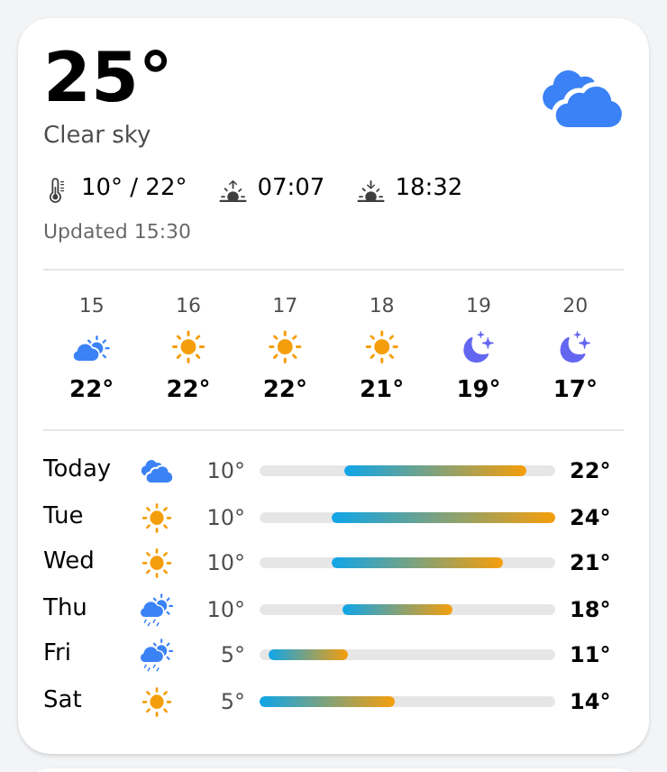

# stat_tile — glance tile for any value

Half-width tile in the shared page design (18 px card, icon + 12 px title, 26 px bold value with unit, optional status pill,
11 px sub line and a 24 h trend line). Used for conditions, rain/wind and the system status, next to `gas_cost_card`
and `humidity_room_card`. Native components only; optional parts render through repeaters, so the page editor shows exactly
what is configured.

Place two per row: `oh-grid-col width 50` with `padding: 4px`, in a row with `margin: 0`. Pass the value as an expression on the page,
e.g. `value: =Number.parseFloat(items['X'].state).toFixed(1)`.

## Props
| Prop | Required | Default | Description |
|---|---|---|---|
| `title` | Yes | — | Tile title (12 px, 70 % opacity). |
| `icon` | No | `circle_fill` | f7 icon name (e.g. thermometer) or a full icon id such as iconify:mdi:cpu-64-bit. |
| `color` | No | `#0ea5e9` | CSS colour of the icon and the trend line. |
| `value` | No | — | Big value (26 px bold). Usually an expression on the page, e.g. =Number.parseFloat(items['X'].state).toFixed(1). |
| `unit` | No | — | Small unit text next to the value. |
| `valueColor` | No | — | Optional CSS colour of the value (e.g. a status colour). |
| `right` | No | — | Optional short text at the top right (12 px semibold). |
| `pill` | No | — | Optional pill text under the value (12 px). |
| `pillColor` | No | `gray` | green, amber, red, blue or gray. |
| `sub` | No | — | Optional line under the pill (11 px, 75 % opacity). |
| `trendItem` | No | — | Numeric item for the 24 h trend line (default persistence). Empty = no trend. |
| `analyzerItems` | No | — | Comma-separated items; tapping opens the analyzer chart for them. |
| `page` | No | — | Page opened on tap (page:<uid>) when no analyzer items are set. |
| `height` | No | — | Optional fixed height to line tiles up in a row. |

Tapping opens the analyzer chart for `analyzerItems`, or the page in `page`; with neither the tile is not clickable. Use `height` to line tiles of different content up in one row.

## Changelog

### Version 1.0.0

- Initial release.
