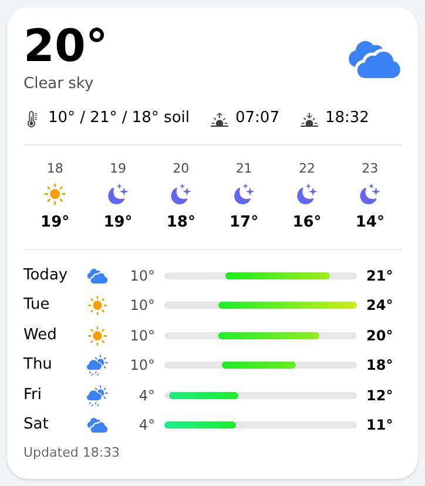

# weather_card — weather overview card

Current weather, the next six hours and six days in one card, built from native components and the OpenWeatherMap forecast items:
temperature with condition and day/night icon, today's min/max, sunrise/sunset, an hourly strip (time, icon, temperature) and a daily list
with min/max range bars. Replaces the marketplace `semanticHomeMenu_Weather`.

Item convention: `<forecastPrefix>Hours01..06_Timestamp/_Iconid/_Temperature` and `<forecastPrefix>Today|Tomorrow|Day2..Day5_Iconid/_Mintemperature/_Maxtemperature`
(the openHAB OpenWeatherMap binding's forecast channel groups).

## Props
| Prop | Required | Default | Description |
|---|---|---|---|
| `tempItem` | No | `Netatmo_Weather_Station_Outdoor_Temperature` | Current outdoor temperature. |
| `conditionItem` | No | `OpenWeatherMap_Forecast_API_Current_Condition` | Condition text (String). |
| `iconItem` | No | `OpenWeatherMap_Forecast_API_Forecasts_ForecastToday_Iconid` | OpenWeatherMap icon id of today (e.g. 03d); the night variant is picked from the trailing d/n. |
| `minItem` | No | `OpenWeatherMap_Forecast_API_Forecasts_ForecastToday_Mintemperature` | Today's minimum temperature. |
| `maxItem` | No | `OpenWeatherMap_Forecast_API_Forecasts_ForecastToday_Maxtemperature` | Today's maximum temperature. |
| `sunriseItem` | No | `LocalSun_Rise_Start` | DateTime item. |
| `sunsetItem` | No | `LocalSun_Set_Start` | DateTime item. |
| `updatedItem` | No | `Netatmo_Weather_Station_Measures_Timestamp` | DateTime of the last station measurement. |
| `forecastPrefix` | No | `OpenWeatherMap_Forecast_API_Forecasts_Forecast` | Prefix of the OpenWeatherMap forecast items: <prefix>Hours01..06_Timestamp/_Iconid/_Temperature and <prefix>Today/Tomorrow/Day2..Day5_Iconid/_Mintemperature/_Maxtemperature. |

## Changelog

### Version 1.1.0

- Soil temperature after min/max (`soilItem`, "10° / 21° / 18° soil")
- "Updated" time moved to a left-aligned footer line
- Daily range bars are coloured by absolute temperature (blue below zero → green → yellow → red above 35 °C) instead of the same gradient for every day

### Version 1.0.0

- Initial release.
